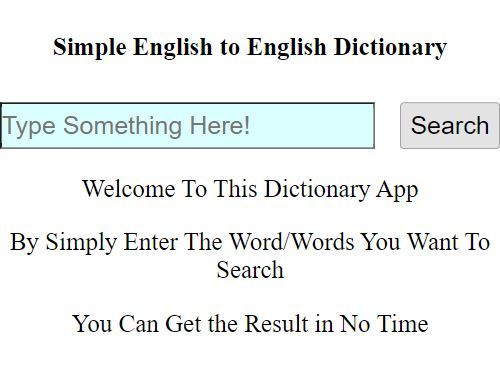
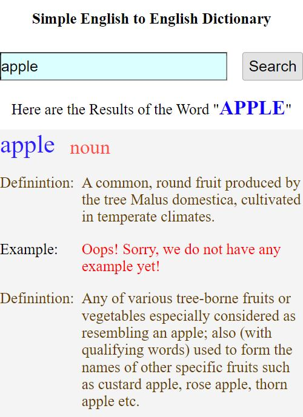
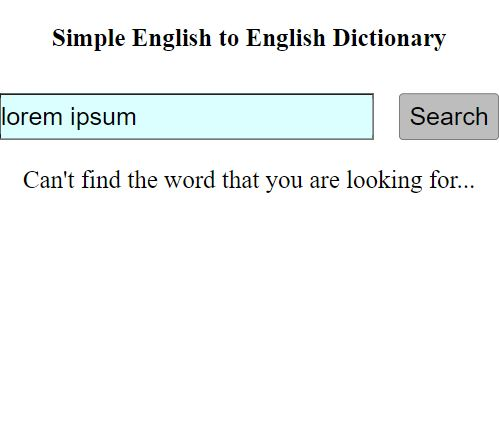

# 英英字典 Simple English to English Dictionray
### 本專案基於Free Dictionary API 所實踐而成。
### 使用Vue與原生JS Fetch API，並使用Vue Cli 開發環境。

<br/>

# 設計理念：
### 最初是為了解決應英系同學英英字典的困擾而萌生出來的主意。
### 而後在[Public APIs](https://github.com/public-apis/public-apis)中，找到了[免費的英英字典API](https://dictionaryapi.dev/)可以使用

<br/>

# 本專案特色
### 清楚明瞭的介面，並且可以輕鬆查詢想要的單字
### 

### 查詢成功的畫面
### 

### 查詢失敗顯示的提示訊息
### 
<br>

<br/>

# 所使用的API連結
### Free Dictionary API (https://dictionaryapi.dev/)

<br>

# 如何安裝建置此APP

### 建置的第一步驟 (Project setup)
```
npm install
```

### 建置完成之後進入開發階段開啟APP (Compiles and hot-reloads for development)
```
npm run serve
```

<!-- ### Compiles and minifies for production
```
npm run build
```

### Lints and fixes files
```
npm run lint
```

### Customize configuration
See [Configuration Reference](https://cli.vuejs.org/config/). -->
